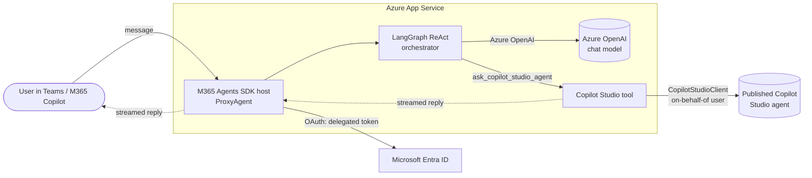

# LangGraph proxy agent with a Copilot Studio tool

New
{: .label .label-green }

A pro-code **custom engine agent** for Microsoft Teams and Microsoft 365 Copilot,
built with the **Microsoft 365 Agents SDK** (TypeScript). It runs a **LangGraph**
orchestrator on **Azure OpenAI** and exposes a published **Copilot Studio** agent as
a tool, calling it with the signed-in user's identity (delegated SSO) and streaming
the answer back into the chat.

Use this sample when you want an existing AI solution (here, a LangGraph app) to act
as the front door in Microsoft 365 while delegating a specialized skill — in the demo,
finding hotels — to a Copilot Studio agent.

{: .note }
> The orchestrator is a plain LangGraph ReAct agent. Swap in your own graph, tools, or
> model and keep the Agents SDK hosting, SSO, and Copilot Studio plumbing unchanged.

## Architecture



1. A user messages the agent in Teams or Microsoft 365 Copilot.
2. The **ProxyAgent** (`src/agent.ts`) handles the turn. Its `MCS` authorization handler
   ensures a delegated token for the Power Platform API (a one-time sign-in per user).
3. The **LangGraph orchestrator** (`src/mcs/orchestrator.ts`) decides which tool to call.
4. For hotel/travel questions it calls **`ask_copilot_studio_agent`** (`src/mcs/mcsTool.ts`),
   which uses `@microsoft/agents-copilotstudio-client` to talk to the published agent
   **as the user** (on-behalf-of token exchange).
5. The Copilot Studio agent's response is **streamed** back to the chat in real time.

## What you get

- **Custom engine agent** surfaced in Teams and Microsoft 365 Copilot.
- **LangGraph + Azure OpenAI** orchestration you fully control.
- **Delegated (SSO) access** to Copilot Studio — the agent acts as the signed-in user,
  not a shared service account.
- **Streaming** responses.
- **Infrastructure as code** (Bicep) and **Microsoft 365 Agents Toolkit** provisioning.
- A **one-command deploy** script and a **smoke test** you can run after deploying.

## Prerequisites

- **Node.js 22 or 24** and npm.
- **Azure subscription** with permission to create resources and assign roles.
- The **Microsoft 365 Agents Toolkit CLI** (`atk`). Optional — the deploy script runs it via
  `npx` if it isn't installed. To install it globally anyway:
  `npm install -g @microsoft/m365agentstoolkit-cli`
- A **published Copilot Studio agent** — you need its **environment ID** and **schema name**
  (Copilot Studio → your agent → *Settings → Advanced → Metadata*).
- An **Azure OpenAI** resource with a chat **deployment** (default `gpt-4o`) and its **API key**.
- A **Microsoft 365 tenant** where you can upload/sideload a custom app.

## Quick start (one command)

From this folder:

```bash
# macOS / Linux
./scripts/deploy.sh
```

```powershell
# Windows
./scripts/deploy.ps1
```

The script checks prerequisites, prompts for the handful of values above, writes them to
`env/.env.dev` (secrets to the git-ignored `env/.env.dev.user`), builds the project, then
runs `atk provision` and `atk deploy`. When it finishes it prints how to install the app
package it built at `appPackage/build/appPackage.dev.zip`.

{: .tip }
> Already know your values? Export them first (for example `MCS_ENVIRONMENT_ID`,
> `MCS_SCHEMA_NAME`, `AZURE_OPENAI_ENDPOINT`, `SECRET_AZURE_OPENAI_API_KEY`) and the
> script runs unattended — handy for CI.

Then install the app and try it:

1. In Teams: **Apps → Manage your apps → Upload an app → Upload a custom app** and pick
   `appPackage/build/appPackage.dev.zip` (or run
   `atk install --file-path appPackage/build/appPackage.dev.zip --env dev`).
2. Open the agent and say hello. The **first message** triggers a one-time sign-in that
   grants the agent delegated access to Copilot Studio.
3. Ask a hotel question, e.g. *"What are the available hotels?"* — the LangGraph
   orchestrator routes it to your Copilot Studio agent and streams the reply.

Prefer to run the two toolkit steps yourself, or need the full details? See the
[Azure deployment guide](docs/AZURE_DEPLOYMENT).

## Configuration

The deploy script and toolkit read these from `env/.env.dev`
(secrets from `env/.env.dev.user`). The same values are injected as App Service settings
by the Bicep templates, so the running bot needs no separate `.env`.

| Variable | Required | Description |
|----------|----------|-------------|
| `MCS_ENVIRONMENT_ID` | Yes | Power Platform environment ID of the published Copilot Studio agent. |
| `MCS_SCHEMA_NAME` | Yes | Schema name of the Copilot Studio agent (e.g. `cr123_myAgent`). |
| `MCS_CONNECTION_NAME` | No | Bot Service OAuth connection for Copilot Studio. Defaults to `mcs`. |
| `AZURE_OPENAI_ENDPOINT` | Yes | Azure OpenAI endpoint, e.g. `https://<res>.openai.azure.com/`. |
| `AZURE_OPENAI_DEPLOYMENT` | No | Chat deployment name. Defaults to `gpt-4o`. |
| `AZURE_OPENAI_API_VERSION` | No | API version. Defaults to `2024-12-01-preview`. |
| `SECRET_AZURE_OPENAI_API_KEY` | Yes | Azure OpenAI API key. Kept in `env/.env.dev.user` (git-ignored). |
| `AZURE_SUBSCRIPTION_ID` | No | Target subscription. Blank ⇒ you're prompted during provision. |
| `AZURE_RESOURCE_GROUP_NAME` | No | Target resource group. Blank ⇒ prompted/created during provision. |
| `RESOURCE_SUFFIX` | No | Suffix that makes Azure resource names globally unique. Auto-generated if blank. |

## How authentication works

Provisioning creates **two** Bot Service OAuth connections and an Entra app registration:

- **`SsoConnection`** — Teams/Microsoft 365 single sign-on into the bot.
- **`mcs`** — the connection the `MCS` authorization handler uses to obtain a **delegated**
  Power Platform token (scope `https://api.powerplatform.com/.default`, permission
  `CopilotStudio.Copilots.Invoke`) via on-behalf-of exchange. This is what lets the agent
  call Copilot Studio *as the signed-in user*.

The app registration (`infra/modules/app-registration.bicep`) grants the Power Platform API
permissions; the connections are wired up in `infra/azure.bicep`. In production the bot
authenticates with a **user-assigned managed identity** (no client secret).

## Local development (F5)

You can run and debug the agent locally with a dev tunnel and the Agents Toolkit VS Code
extension (press **F5**), or from the CLI. Local run uses `env/.env.local` plus
`env/.env.local.user` for secrets. See the [local development guide](docs/LOCAL_DEPLOYMENT)
for the full walkthrough.

## Testing

After a deploy you can exercise the live agent from the command line:

```bash
npm run smoke        # drives the deployed bot over Direct Line
```

The [smoke test](scripts/smoke-test.mjs) starts a conversation, sends a hotel question, and
prints the streamed reply. Because every turn requires the `MCS` sign-in, the script prints
the one-time sign-in link when the bot asks for it; complete it once and re-run. See the
[testing section](docs/AZURE_DEPLOYMENT#testing-the-deployed-agent) of the deployment guide
for details and the Teams-based alternative.

## Project structure

```
m365-langgraph-mcs-tool/
├── src/
│   ├── agent.ts              # ProxyAgent: turn handling, MCS auth handler, streaming
│   ├── config.ts             # Environment-variable configuration
│   ├── index.ts              # Express host entry point
│   └── mcs/
│       ├── orchestrator.ts   # LangGraph ReAct agent (Azure OpenAI + tools)
│       ├── mcsTool.ts        # ask_copilot_studio_agent tool
│       ├── mcsClientFactory.ts   # Builds CopilotStudioClient
│       ├── mcsTokenProvider.ts   # On-behalf-of token for Copilot Studio
│       └── mcsActivityProcessor.ts
├── infra/                    # Bicep templates (App Service, Bot, OAuth connections, RBAC)
├── appPackage/               # Teams app manifest and icons
├── env/                      # Agents Toolkit environment files
├── scripts/
│   ├── deploy.sh / deploy.ps1    # One-command provision + deploy
│   ├── smoke-test.mjs            # Post-deploy Direct Line test
│   └── devtunnel.sh / .ps1       # Local dev tunnel helpers
├── m365agents.yml            # Provision/deploy orchestration (cloud)
├── m365agents.local.yml      # Provision/deploy orchestration (local)
└── docs/                     # Azure and local deployment guides
```

## Troubleshooting

{: .warning }
> **`MCS_ENVIRONMENT_ID is not configured` on startup.** The environment ID and schema name
> weren't provisioned into the app settings. Re-run the deploy script (or `atk provision`)
> with those values set.

- **The agent replies but never calls Copilot Studio.** Confirm `MCS_ENVIRONMENT_ID` and
  `MCS_SCHEMA_NAME` point at a *published* agent, and that the sign-in completed.
- **Sign-in loops or fails.** Check the `mcs` OAuth connection exists on the Azure Bot and
  that the app registration has admin consent for the Power Platform API permissions.
- **`atk provision` fails on name conflicts.** Set a unique `RESOURCE_SUFFIX` (the deploy
  script generates one automatically).

## Additional resources

- [Microsoft 365 Agents SDK](https://learn.microsoft.com/microsoft-365/agents-sdk/)
- [Microsoft 365 Agents Toolkit](https://learn.microsoft.com/microsoft-365/developer/overview-m365-agents-toolkit)
- [Copilot Studio Client (`@microsoft/agents-copilotstudio-client`)](https://www.npmjs.com/package/@microsoft/agents-copilotstudio-client)
- [LangGraph](https://langchain-ai.github.io/langgraphjs/)

## License

Licensed under the MIT License. See [LICENSE](LICENSE).
