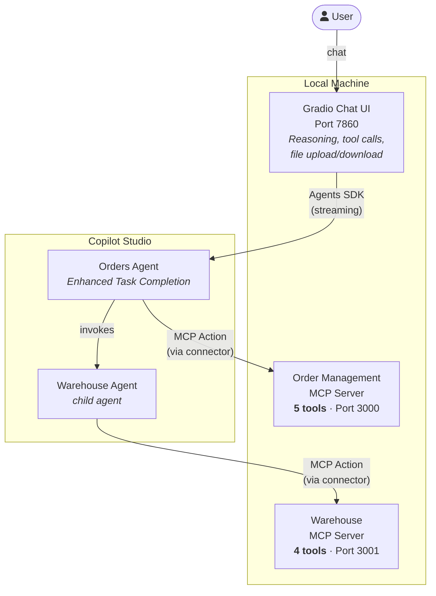

# Order Management with Enhanced Task Completion

An end-to-end sample demonstrating Copilot Studio agents with **Enhanced Task Completion** calling MCP servers for e-commerce order management and warehouse fulfillment, with a **Gradio chat UI** that renders tool calls, reasoning, and file attachments inline.

## Architecture



## What's Included

| Component | Description |
|---|---|
| `mcp-servers/order-management/` | Node.js MCP server with 5 tools: search_orders, get_order, get_shipment, request_return, get_return_status |
| `mcp-servers/warehouse/` | Node.js MCP server with 4 tools: check_stock, get_fulfillment_status, find_alternatives, get_restock_date |
| `connectors/` | Power Platform custom connector definitions (Swagger + apiProperties) for both MCP servers |
| `agents/solution/` | Importable Power Platform solution zips for both agents |
| `agents/sourcecode/` | Unpacked solution source (YAML) for review |
| `chat-ui/` | Gradio chat frontend with inline tool call rendering, reasoning display, and file upload/download |
| `scripts/` | Cross-platform Node.js scripts for setup, server management, and connector deployment |

## MCP Server Tools

### Order Management (5 tools, interdependent)

| Tool | Input | Purpose |
|---|---|---|
| `search_orders` | Customer name/email/order# | Entry point — find orders |
| `get_order` | order_id | Full order details + line items |
| `get_shipment` | order_id | Tracking info (shipped/delivered only) |
| `request_return` | order_id, item_skus[], reason | Initiate a return |
| `get_return_status` | return_id | Check return progress |

### Warehouse (4 tools, interdependent)

| Tool | Input | Purpose |
|---|---|---|
| `check_stock` | SKU | Inventory levels + warehouse location |
| `get_fulfillment_status` | order_id | Pipeline stage (received → shipped) |
| `find_alternatives` | SKU | Similar products in stock |
| `get_restock_date` | SKU | Next inbound shipment date |

## Prerequisites

- Node.js 18+
- Python 3.12+
- [Dev Tunnels CLI](https://learn.microsoft.com/en-us/azure/developer/dev-tunnels/get-started) (`devtunnel`)
- A Power Platform environment with Copilot Studio
- An Entra ID app registration with `CopilotStudio.Copilots.Invoke` permission

## Quick Start

### 1. Install dependencies

```bash
node scripts/setup.mjs
```

### 2. Import agents (first time only)

Import `agents/solution/OrderManagementMCPDemo.zip` into your environment via **make.powerapps.com > Solutions > Import**. This creates the agents, connectors, and connections. See [agents/IMPORT.md](./agents/IMPORT.md) for details.

### 3. Start MCP servers + tunnels

```bash
node scripts/start.mjs
```

This starts both MCP servers and creates anonymous dev tunnels. Note the tunnel URLs printed:

```
Order Management MCP endpoint: https://xxxxx-3000.uks1.devtunnels.ms/mcp
Warehouse MCP endpoint: https://xxxxx-3001.uks1.devtunnels.ms/mcp
```

### 4. Update connector URLs

Each time you restart (tunnels get new URLs), update the custom connector hosts:

1. Go to **make.powerapps.com** > **Custom connectors**
2. Find **"orders mcp"** > click **Edit** > update the **Host** field with the order tunnel host (e.g., `xxxxx-3000.uks1.devtunnels.ms`) > click **Update connector**
3. Find **"warehouse server 3"** > click **Edit** > update the **Host** field with the warehouse tunnel host (e.g., `xxxxx-3001.uks1.devtunnels.ms`) > click **Update connector**

No need to republish the agents — the connectors are referenced dynamically.

### 5. Start the chat UI

```bash
cp chat-ui/.env.sample chat-ui/.env
# Edit chat-ui/.env with your agent details
node scripts/start-ui.mjs
```

Open http://localhost:7860

## Sample Queries

**Basic order lookup:**
> Hi, I'm Sarah Mitchell. I ordered some Sony headphones recently but they arrived with a crackling sound in the left ear. I'd like to return them.

**Cross-server (orders + warehouse):**
> I'm James Rivera. My Nintendo Switch order hasn't shipped yet. When can I expect it? If it's not available, what are my options?

**File upload — populate a CSV:**
> Upload `chat-ui/data/demo-orders.csv` and ask: "Fill in all the empty columns for each order and return the completed CSV."

## Chat UI Features

The Gradio frontend renders the full Enhanced Task Completion activity protocol:

- **Reasoning steps** — agent thinking displayed as collapsible accordions
- **Tool calls** — grouped with parameters, duration, and results
- **Intermediate messages** — agent narration between tool call batches
- **File upload** — CSV/text files sent as base64 attachments (same protocol as MCS test pane)
- **File download** — agent-generated files decoded and offered for download
- **MSAL auth** — persisted token cache, sign in once
